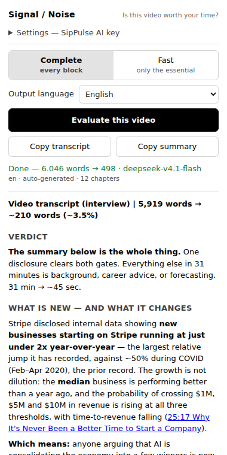

<p align="center">
  
</p>

# Signal / Noise — yttranscribe + signal-noise

Turn a YouTube video into a decision about whether to watch it.

Three pieces, one question — **is this worth 31 minutes, and if not, which 90 seconds are?**

- **Signal / Noise** — a Chrome extension that answers it next to the video. It harvests the episode's transcript, applies the skill below with DeepSeek 4.1 Flash on [SipPulse AI](https://sippulse.ai), and shows the verdict in a side panel. The only configuration is a SipPulse AI key.
- **`signal-noise`** — the [skill](https://docs.claude.com/en/docs/agents-and-tools/agent-skills/overview) itself: the rules that compress a transcript into a verdict, the facts, and a list of what to skip. The extension sends this exact file as its prompt; any agent can load it too.
- **`yttranscribe`** — a CLI that prints a YouTube episode's transcript in about a second, headless and in batch. The extension's **Copy transcript** button does the same for the open video.

Signal / Noise is the first *app da quinzena* — app of the fortnight — built on SipPulse AI.

## The ten-second version

A 31-minute Y Combinator interview, 5,919 words. Here is the whole output:

> **Verdict — the summary below is the whole thing.** One disclosure clears both gates. Everything
> else in 31 minutes is background, career advice, or forecasting. 31 min → ~45 sec.
>
> **What is new — and what it changes.** Stripe disclosed internal data showing new businesses
> starting on Stripe at **just under 2x year-over-year**, its largest recorded jump, against ~50%
> during COVID — and not dilution: the *median* business is doing better and $1M/$5M/$10M
> threshold-crossing is rising ([25:17](https://www.youtube.com/watch?v=5d6y3poKwK4&t=1517s)).
>
> **Which means:** anyone arguing AI is consolidating the economy into a few winners is arguing
> against the payment rails' own numbers — and with **25% of all Delaware corporations** now
> incorporated through Stripe Atlas, this is closer to a census of US company formation than to one
> vendor's book.
>
> **Skip list —** `0:00 Intro` · `0:07 What Should You Still Learn` · `5:12 Should You Drop Out` ·
> `9:58 Why Stripe Worked` · `17:20 Is the Lean Startup Still the Right Playbook?` (speculation,
> explicitly "I don't know") · `22:36 Will AI Kill Your Startup?` · `30:45 Build Something People Truly Need`

See [`examples/`](./examples/) for [the input shape](./examples/input-transcript.md) and [the full output](./examples/output-summary.md), which was not hand-edited. The source transcript belongs to Y Combinator and is not redistributed here; one command regenerates it.

Note what happened to `17:20`. It is the most quotable chapter in the video, and it is in the skip list — because the speaker says "I don't know" and offers no data. That is the entire point of the skill.

## Install the extension

No build step, no Web Store. About a minute, plus a SipPulse AI key.

1. **Download the code.** Either `git clone https://github.com/flaviogoncalves/signal-noise.git`, or use **Code → Download ZIP** on this page and unzip it.
2. Open Chrome and go to **`chrome://extensions`** (type it in the address bar — it is not in the menus).
3. Turn on **Developer mode** with the toggle in the **top-right** corner. Nothing appears to happen; this just reveals the buttons in step 4.
4. Click **Load unpacked** (top-left).
5. In the folder picker, select the **`extension/`** folder inside the code you downloaded — **not** the top folder. You should be selecting the folder that directly contains `manifest.json`.
6. "Signal / Noise" now appears in your extension list. Click the puzzle-piece icon in the Chrome toolbar and **pin** it so the button is always visible.
7. Click the button. A side panel opens with **Settings** already unfolded: paste your [SipPulse AI](https://sippulse.ai) key and click **Save key**. The key is checked on the spot, and the panel tells you which model it will use. That is the only configuration there is.

**Using it:** open any YouTube video, click the button, click **Evaluate this video**. The summary streams into the panel beside the player. Click any chapter anchor in it and the video jumps there — no reload, no new tab.

<p align="center">
  
</p>

Two parameters sit above the button, and both are remembered:

- **Complete / Fast.** Complete is the skill's full output: verdict, what is new, thesis, signal, skip list, numbers, tensions. Fast keeps only the essential — verdict, what is new, at most five lines of signal — and ends with one line saying what Complete would add. Fast reports less; it does not read less. Both judge the whole transcript by the same rules.
- **Output language.** Your browser's language by default, a language you pick, or "same as the video". Chapter titles, quotes and technical terms stay in the original either way, so anchors still match what YouTube shows you.

**Copy transcript** still does what the extension used to be for: the episode's transcript on your clipboard, for pasting into anything else. **Copy summary** copies the evaluation as Markdown.

The extension asks for four permissions — `sidePanel`, `scripting`, `storage`, and `clipboardWrite` — and is restricted to two hosts: `https://www.youtube.com/*` and `https://api.sippulse.ai/*`. It has no server of its own and no analytics. The key is stored in this browser only, never synced, and **Remove key** deletes it. Nothing leaves for SipPulse AI until you click Evaluate, and then what leaves is the transcript of that one video; Copy transcript talks to nobody but YouTube.

<details>
<summary><strong>If it does not work</strong></summary>

- **"Manifest file is missing or unreadable"** — you selected the wrong folder in step 5. Select `extension/`, the one containing `manifest.json`.
- **"Open a YouTube video first"** — expected on any other page. It only acts on `youtube.com/watch` pages.
- **"SipPulse AI rejected the key"** — open **Settings** at the top of the panel and save the key again; saving re-checks it. **Remove key**, next to it, deletes the key from the browser.
- **"This key cannot use DeepSeek 4.1 Flash"** — the key works, but its organization cannot use the model the extension runs on. The message lists the DeepSeek models it can see. The extension will not use a different one, not even another Flash; see [ADR 0004](./docs/adr/0004-the-extension-evaluates-through-sippulse-ai.md).
- **The summary says it was cut off** — the model hit its output limit. Try Fast.
- **"This episode has no captions"** — also expected, and not a bug. yttranscribe harvests transcripts that already exist; it never generates them. See [ADR 0002](./docs/adr/0002-harvest-only-never-transcribe.md).
- **It stopped working after a YouTube change** — possible; this is unofficial and uses no documented API. See [Reliability](#reliability).
- **You edited the source** — run `npm run build` and then hit the refresh icon on the extension card in `chrome://extensions`.

</details>

## Install the CLI

Optional. Same code, useful for batches and for piping into other tools.

```bash
git clone https://github.com/flaviogoncalves/signal-noise.git
cd signal-noise
npm install && npm run build

# print to stdout
node dist/cli.js "https://www.youtube.com/watch?v=5d6y3poKwK4"

# write one Markdown file per episode
node dist/cli.js <url> <url> --out ~/Documents/podcasts
```

Requires Node 18+ (developed on 22).

## Install the skill

`signal-noise` lives in [`skills/signal-noise/`](./skills/signal-noise/). It is two files — `SKILL.md` and `references/source-types.md` — and **both matter**: the second carries the per-type rules for contracts, papers, proposals and meetings. The skill degrades on non-video input without it.

**Claude Code**

```bash
cp -r skills/signal-noise ~/.claude/skills/
```

The directory name must stay `signal-noise`, matching the `name:` in the frontmatter. It is picked up on the next invocation — no restart needed. Confirm with `/signal-noise`.

**claude.ai (web and desktop app)**

Skills are per-account, so one upload covers both. Zip the folder so the archive contains `signal-noise/SKILL.md` — not a doubled `signal-noise/signal-noise/` — then add it under **Settings → Skills** (documented as Settings → Features). Requires a plan with code execution enabled. To update later, use **Replace** on the existing skill rather than uploading a second copy.

**Claude API**

Upload through the `/v1/skills` endpoints, then reference the returned `skill_id` in the `container` parameter. Requires the [code execution tool](https://platform.claude.com/docs/en/agents-and-tools/tool-use/code-execution-tool) and the `skills-2025-10-02` beta header. API skills are workspace-wide. Note the sandbox has no network access — irrelevant here, since `signal-noise` only reads text you paste in.

> **Skills do not sync between surfaces.** Claude Code, claude.ai and the API each hold their own copy. Installing in one does nothing for the others, so update each place you actually use.

### Other harnesses

`SKILL.md` is Anthropic's Agent Skills format, and no other tool reads it natively. But the file is plain Markdown with a YAML header — the instructions are portable even though the packaging is not.

Most other agents read [**AGENTS.md**](https://agents.md), the open standard now stewarded by the Linux Foundation and read natively by Codex, Cursor, GitHub Copilot, Gemini CLI, Aider, Windsurf, Zed, Devin, Amp and Jules, among others.

**The naive port — and why not to do it.** You can paste the body of `SKILL.md` straight into `AGENTS.md` and it will work. The cost is that `AGENTS.md` is loaded on *every* turn, while a Skill loads only when triggered. This file is ~20k characters; carrying that into every request in a coding session to summarise the occasional transcript is a bad trade.

**Better: keep it a file, point at it.** Copy `skills/signal-noise/` into your repo, then add a few lines to `AGENTS.md`:

```markdown
## Summarising long material

When asked to summarise, condense, or extract the signal from a transcript,
contract, paper, proposal, or long document — including the Portuguese
"resumir" / "filtra o ruído" — read `skills/signal-noise/SKILL.md` first and
follow it. For anything that is not video, also read
`skills/signal-noise/references/source-types.md`.
```

That reproduces the on-demand behaviour: a few dozen tokens always resident, the full instructions pulled in only when relevant. It is the same trick the skill format uses, done by hand.

Tool-specific homes, if you prefer them to `AGENTS.md`: Cursor reads `.cursor/rules/*.mdc`, Copilot reads `.github/copilot-instructions.md`, and Windsurf and Zed have their own rules files — the pointer snippet above works unchanged in any of them.

**What you lose off-Claude:** automatic triggering from the `description`. Elsewhere the agent only follows the skill if your instructions file tells it to, or if you ask for it by name.

## Using the skill without the extension

The extension is the short path. The long one still works, and is the one to use for anything that is not a YouTube video, or with a model of your own choosing:

1. Open a video. Click **Copy transcript** in the panel — or run the CLI.
2. Paste it into Claude and ask for a summary — or just paste it, since the skill triggers on its own. Ask for it "fast" to get Fast mode.

The transcript arrives with a header that makes the paste self-describing:

```
# Title
**Channel:** ...
**Duration:** 34m
**URL:** https://...

## Chapters
- 0:00 — Intro
- 10:29 — Startup Idea 1

## Transcript
[continuous prose, no inline timestamps]
```

That shape is what makes the summary navigable. The chapter list lets `signal-noise` anchor each claim to a real chapter and turn it into a clickable link (`10:29` → `&t=629s`), and the URL in the header is what those links are built from. No chapters means no anchors, and the skill says so rather than inventing them.

## What signal-noise actually does

The premise: a bad summary gets shorter by cutting content; a good one gets shorter by cutting rhetorical redundancy and keeping 100% of what carries weight.

For video specifically, four rules do most of the work:

- **Two gates: new AND relevant.** A claim must be something the reader could not already have known, *and* something with a consequence. New-but-inconsequential is trivia and gets cut; relevant-but-old is labelled background rather than promoted. Relevance is judged generally, never against one reader's assumed interests — the summary names *who* is affected and *what changes*, so any reader can tell in one line whether it concerns them. When nothing clears both gates, saying "nothing here is new" is the whole output, and a valuable one.
- **The Verdict is a decision, not a hedge.** One of three calls — watch it all, skim these chapters, or the summary is the whole thing — chosen on fact density rather than on how good the talk was. "Worth watching in full" has to be earned by something a transcript cannot carry: a demo, a document on screen, tone that changes the meaning.
- **Opinion is noise until it is earned.** Every claim faces one test: *could this be false, and could someone check?* Numbers, dates, mechanisms and decisions are signal. Forecasts, takes and career advice are not — unless they rest on data the speaker uniquely has, or are the speaker describing their own conduct. Cutting an opinion is fine; restating it without its hedge is not.
- **Anchors are chapter-accurate or absent.** There are no inline timestamps in the input, so per-sentence `mm:ss` can only be guessed. Claims are matched to the chapter whose *title* names them, never to a position estimated from how far down the text sits. A link that looks exact and is wrong is worse than no link.
- **Nothing quantitative is ever rounded away.** Numbers keep their units and context, conditionals keep their exceptions, hedges keep their hedging, and contradictions in the source are recorded rather than smoothed into a consensus that was never reached.

It handles more than video — contracts, papers, proposals, meeting transcripts, threads, technical docs — each with its own definition of what counts as signal, in [`references/source-types.md`](./skills/signal-noise/references/source-types.md). The `Verdict` and `Skip list` blocks are video-only; a contract gets `Points of attention` instead.

Output language follows your request, not the source: ask in Portuguese and an English video comes back in Portuguese, with technical terms, direct quotes and chapter titles left in the original so the anchors still match what YouTube shows you.

## Reliability

This is unofficial. It uses no documented API, and it can stop working without notice if YouTube changes how captions are served. There is no server, no browser automation and no headless Chrome involved — a request goes out and a transcript comes back, typically in about a second.

The code is here if you want to know more: the network layer is [`src/youtube/fetchEpisode.ts`](./src/youtube/fetchEpisode.ts).

## Scope

**Does:**

- Evaluate the open YouTube video in a side panel, Complete or Fast, in the language you choose
- Fetch the existing transcript for any YouTube video, headless, in batch
- Prefer human-written captions in the original language; never silently hand you a translation
- Refuse plainly when an episode has no captions

**Deliberately does not:**

- **Transcribe.** No speech-to-text, no audio — see [ADR 0002](./docs/adr/0002-harvest-only-never-transcribe.md). Uncaptioned episodes are refused, not guessed at.
- **Anything but YouTube.** No Spotify, no Apple Podcasts.
- **Offer a choice of provider or model.** One key, one model, found among the models the key can use — see [ADR 0004](./docs/adr/0004-the-extension-evaluates-through-sippulse-ai.md). To use the skill with another model, load it into that model's agent instead.
- **Verify externally, in the extension.** The skill's `Verified addition` block needs tools the extension does not have, so it is switched off there rather than filled from the model's memory — see [ADR 0005](./docs/adr/0005-the-skill-file-is-the-prompt.md). Complete in the extension is the skill's Complete minus that one block.

The CLI's name, `yttranscribe`, is a mild misnomer: it harvests transcripts and never transcribes. Kept because it is short.

## Development

```bash
npm test          # 80 tests
npm run typecheck
npm run build     # CLI to dist/, extension to extension/js/
```

Pure logic is tested — caption parsing, track selection, chapter parsing, URL parsing, formatting, prompt assembly, stream parsing, model resolution, and the Markdown renderer's escaping. `fetchEpisode` is a thin network adapter over a third-party API that changes without notice, so it is verified by running it rather than by fixtures that would give false confidence.

`extension/js/` is generated from `src/`, and `extension/skill/SKILL.md` is copied from `skills/`; both are committed, so the extension can be loaded without a build step. Rebuild with `npm run build` after editing `src/` **or the skill** — the extension runs the copy, not the original.

The icons in `extension/icons/` are PNGs rendered from two SVGs — `icon-small.svg`, drawn on the pixel grid, for 16 and 32px; `icon.svg` for 48 and 128px — and are committed too. After editing an SVG, re-render them with any Chrome: `CHROME=$(which google-chrome) node scripts/render-icons.mjs`.

## Docs

- [CONTEXT.md](./CONTEXT.md) — glossary
- [docs/adr/](./docs/adr/) — decisions: [0004](./docs/adr/0004-the-extension-evaluates-through-sippulse-ai.md), why the extension now evaluates; [0005](./docs/adr/0005-the-skill-file-is-the-prompt.md), why the skill file itself is the prompt; [0006](./docs/adr/0006-a-side-panel-not-a-popup.md), why a side panel; and [0001](./docs/adr/0001-browser-extension-because-sabr-killed-server-side-captions.md), kept as a record of a wrong turn
- [docs/spec/](./docs/spec/) — the original spec, now largely overtaken

## License

[MIT](./LICENSE)
